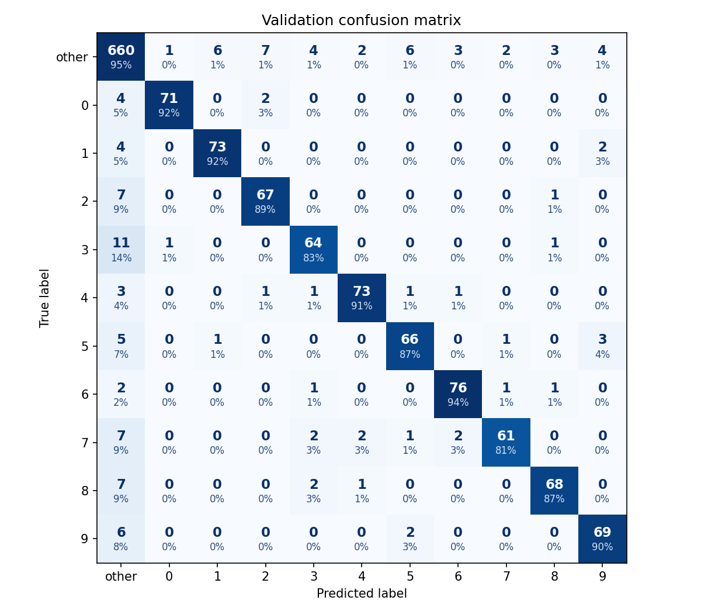
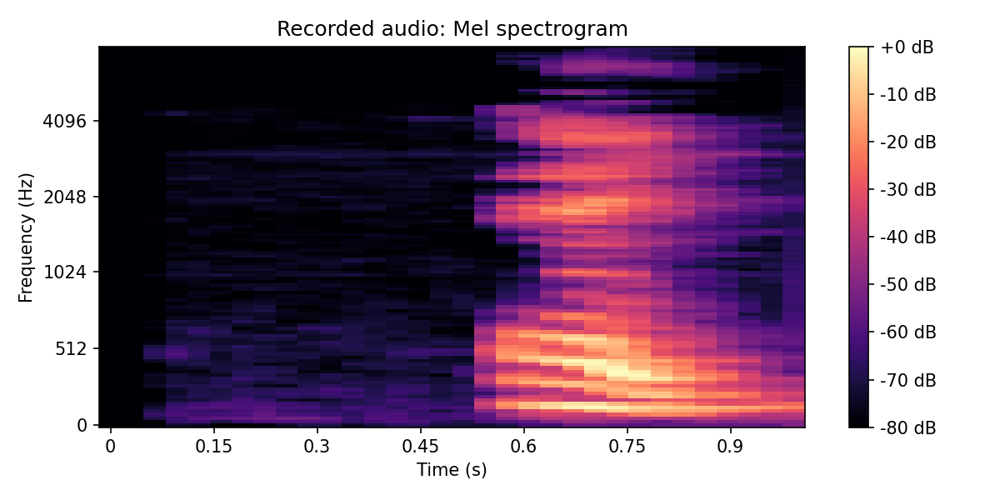
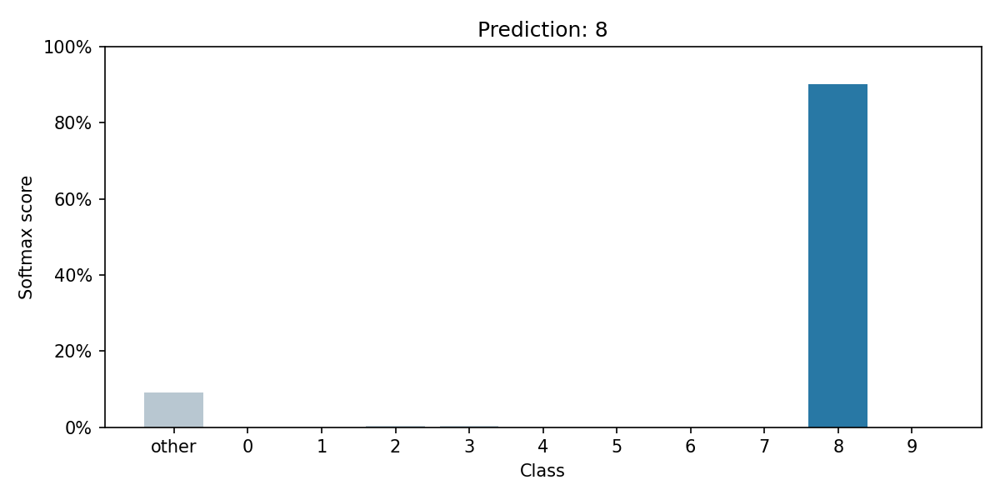

# Spoken-digit recognition

A convolutional neural network for spoken-digit recognition, developed for the
Kaggle iML challenge at ULiège. The model combines 2D and 1D convolutions to classify
digits 0–9 and other/non-digit from 13 MFCC coefficients over 32 time steps.

## Install

```sh
python -m pip install -r requirements.txt
```

Microphone capture uses the default input device. Allow microphone access in your
operating system, some platforms also require PortAudio to be installed separately.

## Data

The organizers supplied `X_train.npy` (14721 x 417), `X_test.npy` (22568 x 417),
and `y_train.npy` (sample ID and label). Feature column 0 is the sample ID;
the remaining 416 values are 32 time steps x 13 MFCC coefficients. Label `-1`
means other; labels `0` through `9` are digits. Padding (`-9999999`) becomes zero.

Training uses these arrays directly. The supplied `wav2mfcc.py` and
`transform_wav.py` generated the MFCC representation. Competition audio and
datasets are not redistributed.

## Train

Place the data arrays in the repository root, or use `--data-dir`.

```sh
python main.py train
python main.py train --full-data
```

Development training uses a stratified 90/10 split and fits the scaler only on
training samples. Full-data training uses all labelled samples without validation.
Both save the model and fitted scaler to `checkpoints/model.pt`. Use `--checkpoint`
to choose another output path.

The matrix below represents the stratified development validation split, cells
show sample counts and row percentages.

<p align="center">
  
</p>

## Predict a WAV

```sh
python main.py predict path/to/audio.wav
```

Prediction prints a `[0-9]` digit or `other`. Use `--checkpoint` to select another model.
WAV preprocessing uses the organizers' MFCC representation and boundary-padding
behavior. Short inputs are padded and inputs over 32 MFCC frames are truncated.

## Predict from the microphone

```sh
python main.py record
```

After the countdown and **Speak!**, capture lasts 1 second. Each run overwrites:

- `recordings/latest.wav`
- `recordings/latest_spectrogram.png`
- `recordings/latest_prediction.png`

These let you listen to the recording, inspect its spectrogram, and compare model
scores across all 11 classes.

<p>
  
  
</p>

## Structure

- `main.py`: commands, training, evaluation, and checkpoints.
- `model.py`, `dataset.py`, `preprocessing.py`: network and array preparation.
- `audio_preprocessing.py`, `inference.py`: WAV prediction.
- `recording.py`, `plots.py`: microphone capture and plots.
- `docs/images/`: selected documentation figures.

Generated `recordings/`, `runtime_outputs/`, and `checkpoints/` folders are ignored
by Git.

## Author

[@Bortrex](https://github.com/Bortrex)
